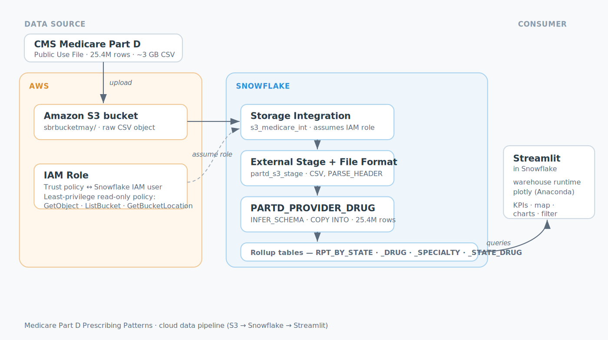

# Medicare Part D Prescribing Patterns — Cloud Data Pipeline & Dashboard

An end-to-end data project that ingests a **25.4-million-row** public healthcare dataset into Snowflake from Amazon S3 using a secure storage integration, models it into performance-optimized rollup tables, and surfaces it through an interactive **Streamlit in Snowflake** dashboard.



> _Add a screenshot of the running dashboard here, e.g._ ``

---

## Overview

The project demonstrates a complete analytics pipeline on a real, openly available healthcare dataset:

- **Ingest** a ~3 GB CSV from Amazon S3 into Snowflake without any local client tools, using a cross-account IAM trust relationship.
- **Model** the raw 25.4M-row table into small pre-aggregated rollup tables so the dashboard stays fast and cheap to query.
- **Visualize** the result with KPIs, a US choropleth map, ranked bar charts, and a cost-vs-volume scatter, all filterable by state.

Everything runs inside Snowflake — no external app hosting, no data leaving the warehouse.

---

## Dataset

**[Medicare Part D Prescribers — by Provider and Drug](https://data.cms.gov/provider-summary-by-type-of-service/medicare-part-d-prescribers/medicare-part-d-prescribers-by-provider-and-drug)** (CMS Public Use File, 2019 data year).

- **25,401,870 rows** — one row per prescriber + drug combination
- Fully public: no IRB approval, no data use agreement
- Each row includes prescriber identity, location, specialty, drug brand/generic name, claim counts, day supply, total drug cost, and beneficiary counts

Chosen because it is genuinely large (clears the 1M-row bar by ~25×), clean, and rich enough to support multiple dimensions of analysis (geography, drug, specialty, cost).

---

## Architecture

```
CMS CSV  →  Amazon S3  →  Storage Integration  →  External Stage  →  Raw Table  →  Rollup Tables  →  Streamlit
                ↑ IAM role (cross-account, read-only)
```

| Layer | Component | Purpose |
|-------|-----------|---------|
| Source | CMS Public Use File | Raw 25.4M-row CSV |
| AWS | S3 bucket + IAM role | Object storage + least-privilege access |
| Snowflake | Storage integration | Assumes the IAM role, no stored keys |
| Snowflake | External stage + file format | Points at the bucket, parses the CSV header |
| Snowflake | Raw table | Schema-inferred landing table |
| Snowflake | Rollup tables | Pre-aggregated for fast dashboard queries |
| Consumer | Streamlit in Snowflake | Interactive dashboard (warehouse runtime) |

---

## 1. Loading: S3 → Snowflake

Rather than uploading multiple GB through a browser or installing a CLI, the file is staged in S3 and read directly by Snowflake. Authentication uses a **storage integration** so no AWS keys are ever stored in Snowflake — Snowflake assumes a cross-account IAM role instead.

### Snowflake objects

```sql
USE ROLE ACCOUNTADMIN;

CREATE WAREHOUSE IF NOT EXISTS WH_LOAD WAREHOUSE_SIZE = 'SMALL' AUTO_SUSPEND = 60;
CREATE DATABASE IF NOT EXISTS HEALTHCARE;
CREATE SCHEMA IF NOT EXISTS HEALTHCARE.MEDICARE;

CREATE OR REPLACE STORAGE INTEGRATION s3_medicare_int
  TYPE = EXTERNAL_STAGE
  STORAGE_PROVIDER = 'S3'
  ENABLED = TRUE
  STORAGE_AWS_ROLE_ARN = 'arn:aws:iam::<AWS_ACCOUNT_ID>:role/snowflake-s3-role'
  STORAGE_ALLOWED_LOCATIONS = ('s3://sbrbucketmay/');

-- Returns STORAGE_AWS_IAM_USER_ARN and STORAGE_AWS_EXTERNAL_ID,
-- which are pasted into the IAM role's trust policy.
DESC INTEGRATION s3_medicare_int;
```

### AWS IAM role

The role is created with a **custom trust policy** (cross-account) so the Snowflake-managed IAM user can assume it, gated by the external ID:

```json
{
  "Version": "2012-10-17",
  "Statement": [
    {
      "Effect": "Allow",
      "Principal": { "AWS": "<STORAGE_AWS_IAM_USER_ARN>" },
      "Action": "sts:AssumeRole",
      "Condition": {
        "StringEquals": { "sts:ExternalId": "<STORAGE_AWS_EXTERNAL_ID>" }
      }
    }
  ]
}
```

The attached **permissions policy** is deliberately read-only and scoped to the single bucket — least privilege, no write/delete:

```json
{
  "Version": "2012-10-17",
  "Statement": [
    {
      "Effect": "Allow",
      "Action": ["s3:GetObject", "s3:GetObjectVersion"],
      "Resource": "arn:aws:s3:::sbrbucketmay/*"
    },
    {
      "Effect": "Allow",
      "Action": ["s3:ListBucket", "s3:GetBucketLocation"],
      "Resource": "arn:aws:s3:::sbrbucketmay"
    }
  ]
}
```

### Stage, schema inference, and load

The file format uses `PARSE_HEADER = TRUE` so column names come straight from the CSV header, and the table schema is **inferred** rather than hand-typed:

```sql
USE SCHEMA HEALTHCARE.MEDICARE;

CREATE OR REPLACE FILE FORMAT CSV_FF_HEADER
  TYPE = CSV
  FIELD_OPTIONALLY_ENCLOSED_BY = '"'
  PARSE_HEADER = TRUE
  NULL_IF = ('', 'NA')
  EMPTY_FIELD_AS_NULL = TRUE;

CREATE OR REPLACE STAGE partd_s3_stage
  STORAGE_INTEGRATION = s3_medicare_int
  URL = 's3://sbrbucketmay/'
  FILE_FORMAT = CSV_FF_HEADER;

-- Verify Snowflake can see the file through the integration
LIST @partd_s3_stage;

-- Infer the 22-column schema directly from the file header
CREATE OR REPLACE TABLE PARTD_PROVIDER_DRUG
  USING TEMPLATE (
    SELECT ARRAY_AGG(OBJECT_CONSTRUCT(*))
    FROM TABLE(
      INFER_SCHEMA(
        LOCATION => '@partd_s3_stage',
        FILE_FORMAT => 'CSV_FF_HEADER',
        FILES => 'MUP_DPR_RY24_P04_V10_DY19_NPIBN.csv'
      )
    )
  );

-- Load — matched by column name, header parsing required
COPY INTO PARTD_PROVIDER_DRUG
  FROM @partd_s3_stage/MUP_DPR_RY24_P04_V10_DY19_NPIBN.csv
  FILE_FORMAT = CSV_FF_HEADER
  MATCH_BY_COLUMN_NAME = CASE_INSENSITIVE
  ON_ERROR = 'CONTINUE';

SELECT COUNT(*) FROM PARTD_PROVIDER_DRUG;   -- 25,401,870, 0 errors
```

---

## 2. Modeling: pre-aggregated rollups

Querying 25.4M rows on every dashboard interaction would be slow and burn warehouse credits. Instead, the raw table is aggregated once into small rollup tables that the dashboard reads from — each only thousands of rows.

```sql
CREATE OR REPLACE TABLE RPT_BY_STATE AS
SELECT
  PRSCRBR_STATE_ABRVTN        AS STATE,
  COUNT(DISTINCT PRSCRBR_NPI) AS PRESCRIBERS,
  SUM(TOT_CLMS)               AS TOTAL_CLAIMS,
  SUM(TOT_DRUG_CST)           AS TOTAL_COST,
  SUM(TOT_BENES)              AS TOTAL_BENES
FROM PARTD_PROVIDER_DRUG
WHERE PRSCRBR_STATE_ABRVTN IS NOT NULL
GROUP BY 1;

CREATE OR REPLACE TABLE RPT_BY_DRUG AS
SELECT
  GNRC_NAME                   AS DRUG,
  SUM(TOT_CLMS)               AS TOTAL_CLAIMS,
  SUM(TOT_DRUG_CST)           AS TOTAL_COST,
  SUM(TOT_BENES)              AS TOTAL_BENES,
  COUNT(DISTINCT PRSCRBR_NPI) AS PRESCRIBERS
FROM PARTD_PROVIDER_DRUG
WHERE GNRC_NAME IS NOT NULL
GROUP BY 1;

CREATE OR REPLACE TABLE RPT_BY_SPECIALTY AS
SELECT
  PRSCRBR_TYPE                AS SPECIALTY,
  COUNT(DISTINCT PRSCRBR_NPI) AS PRESCRIBERS,
  SUM(TOT_CLMS)               AS TOTAL_CLAIMS,
  SUM(TOT_DRUG_CST)           AS TOTAL_COST
FROM PARTD_PROVIDER_DRUG
WHERE PRSCRBR_TYPE IS NOT NULL
GROUP BY 1;

CREATE OR REPLACE TABLE RPT_BY_STATE_DRUG AS
SELECT
  PRSCRBR_STATE_ABRVTN        AS STATE,
  GNRC_NAME                   AS DRUG,
  SUM(TOT_CLMS)               AS TOTAL_CLAIMS,
  SUM(TOT_DRUG_CST)           AS TOTAL_COST
FROM PARTD_PROVIDER_DRUG
WHERE PRSCRBR_STATE_ABRVTN IS NOT NULL AND GNRC_NAME IS NOT NULL
GROUP BY 1, 2;
```

---

## 3. Dashboard: Streamlit in Snowflake

Built as a **warehouse-runtime** Streamlit app, which installs `plotly` from the Snowflake Anaconda channel (no external network access required). The app reads only the rollup tables, fully-qualified by schema.

```python
import streamlit as st
import plotly.express as px
from snowflake.snowpark.context import get_active_session

st.set_page_config(page_title="Medicare Part D Explorer", layout="wide")
session = get_active_session()

st.title("💊 Medicare Part D Prescribing Patterns (2019)")
st.caption("25.4M prescriber-drug records · CMS Part D Public Use File")

@st.cache_data
def q(sql):
    return session.sql(sql).to_pandas()

DB = "HEALTHCARE.MEDICARE"

# Sidebar state filter
states = q(f"SELECT STATE FROM {DB}.RPT_BY_STATE ORDER BY STATE")["STATE"].dropna().tolist()
sel = st.sidebar.multiselect("Filter by state", states)
state_filter = ""
if sel:
    inlist = ",".join("'" + s + "'" for s in sel)
    state_filter = f"WHERE STATE IN ({inlist})"

# KPI row
k = q(f"""SELECT SUM(PRESCRIBERS) P, SUM(TOTAL_CLAIMS) C, SUM(TOTAL_COST) D
          FROM {DB}.RPT_BY_STATE {state_filter}""").iloc[0]

def fmt(n):
    if n >= 1e9: return f"{n/1e9:.1f}B"
    if n >= 1e6: return f"{n/1e6:.1f}M"
    if n >= 1e3: return f"{n/1e3:.1f}K"
    return f"{n:,.0f}"

c1, c2, c3 = st.columns(3)
c1.metric("Prescribers", fmt(k.P))
c2.metric("Total Claims", fmt(k.C))
c3.metric("Total Drug Cost", "$" + fmt(k.D))

# Choropleth — cost by state
st.subheader("Total Drug Cost by State")
df_state = q(f"SELECT STATE, TOTAL_COST FROM {DB}.RPT_BY_STATE")
st.plotly_chart(
    px.choropleth(df_state, locations="STATE", locationmode="USA-states",
                  color="TOTAL_COST", scope="usa", color_continuous_scale="Blues"),
    use_container_width=True)

# Top drugs by cost
st.subheader("Top 15 Drugs by Total Cost")
df_drug = q(f"""SELECT DRUG, TOTAL_COST, TOTAL_CLAIMS
                FROM {DB}.RPT_BY_DRUG ORDER BY TOTAL_COST DESC LIMIT 15""")
st.plotly_chart(
    px.bar(df_drug.sort_values("TOTAL_COST"), x="TOTAL_COST", y="DRUG", orientation="h"),
    use_container_width=True)

# Top specialties
st.subheader("Top 10 Prescriber Specialties by Claims")
df_spec = q(f"""SELECT SPECIALTY, TOTAL_CLAIMS, PRESCRIBERS
                FROM {DB}.RPT_BY_SPECIALTY ORDER BY TOTAL_CLAIMS DESC LIMIT 10""")
st.dataframe(df_spec, use_container_width=True, hide_index=True)

# Cost vs volume scatter
st.subheader("Cost vs. Claim Volume by Drug")
df_sc = q(f"""SELECT DRUG, TOTAL_CLAIMS, TOTAL_COST
              FROM {DB}.RPT_BY_DRUG WHERE TOTAL_CLAIMS > 1000
              ORDER BY TOTAL_COST DESC LIMIT 200""")
st.plotly_chart(
    px.scatter(df_sc, x="TOTAL_CLAIMS", y="TOTAL_COST",
               hover_name="DRUG", log_x=True, log_y=True),
    use_container_width=True)
```

---

## Challenges & learnings

Real-world friction encountered and resolved while building this:

- **No local admin rights / no CLI.** Couldn't install SnowSQL, so the entire pipeline was built through the Snowsight web UI plus a SQL-driven S3 load — a more production-like pattern than a browser file upload anyway.
- **`MATCH_BY_COLUMN_NAME` requires `PARSE_HEADER = TRUE`.** A CSV file format with `SKIP_HEADER` can't match by column name; switching to header parsing fixed the load and let `INFER_SCHEMA` name the columns correctly.
- **Column-count mismatch (22 vs 62).** An early schema inference produced the wrong column count; rebuilding the table from `INFER_SCHEMA` against the correct header-parsing file format resolved it.
- **Trial accounts block External Access Integrations.** The container-runtime Streamlit app couldn't install plotly from PyPI. Switching to the **warehouse runtime**, which pulls packages from the Snowflake Anaconda channel, sidesteps the limitation entirely.
- **`USE SCHEMA` is unsupported in the Snowpark session.** Streamlit-in-Snowflake rejects bare `USE` statements; fully-qualifying every table reference (`HEALTHCARE.MEDICARE.<table>`) is the clean fix.

---

## Tech stack

`Snowflake` · `Amazon S3` · `AWS IAM` · `SQL` · `Python` · `Streamlit` · `Plotly`

## Notes on viewing

Streamlit-in-Snowflake apps are not public web pages — a viewer needs a Snowflake login with `USAGE` granted on the app, database, schema, and warehouse. For showcasing, see the dashboard screenshots above or the short demo recording.
